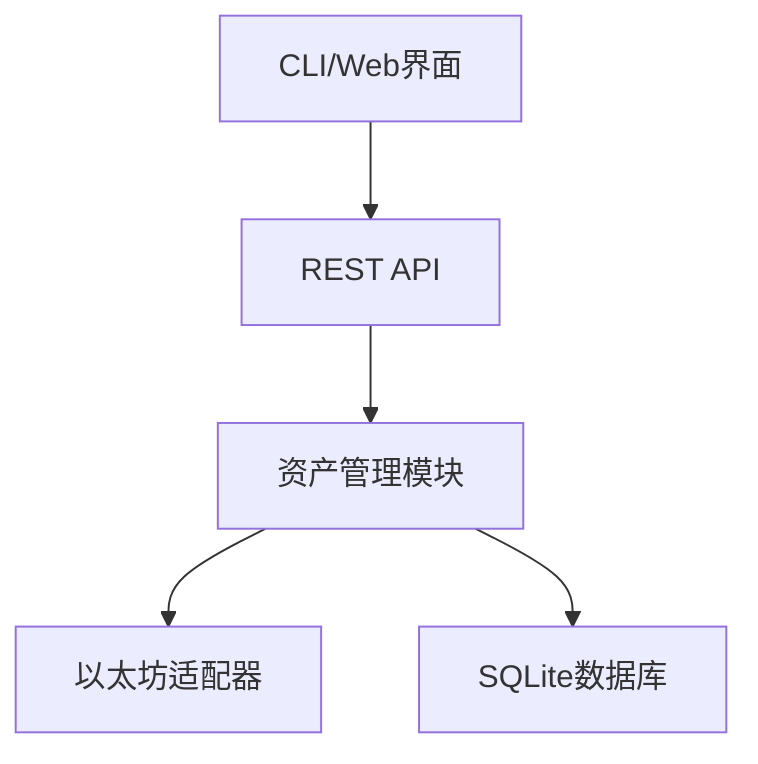

# [Project] w3hub: Web3资产管理工具

## 项目概述
w3hub是一个帮助Web3用户智能管理资产的安全工具，解决以下痛点：
- 🛡️ 资产安全监控：实时追踪多链资产变动
- 🔔 智能预警：价格暴跌、可疑交易即时通知
- 📊 统一视图：跨链资产一站式管理

## 技术实现

### 核心架构


### 关键技术
- 多链支持架构（已实现以太坊）
- 可扩展的预警规则引擎
- 双通道通知（邮件+Telegram）
- Swagger API文档集成

## 功能亮点
1. **实时监控**：
   - 跟踪地址资产变动
   - 交易历史查询
2. **安全预警**：
   - 大额交易提醒
   - 价格波动监控（1小时跌幅>10%触发）
3. **数据持久化**：
   - 资产快照存储
   - 历史记录查询

## 使用说明
```bash
# 启动服务
go run cmd/w3hub/main.go

# API文档
http://localhost:8080/docs/
```

## 后续计划
- [ ] 增加比特币、Solana等多链支持
- [ ] 开发Web可视化界面
- [ ] 实现硬件钱包集成

## 项目信息
- **开发者**: liumeng
- **联系方式**: 2381897793@qq.com
- **代码仓库**: https://github.com/q23818/ETHShanghai-2025/projects/w3hub